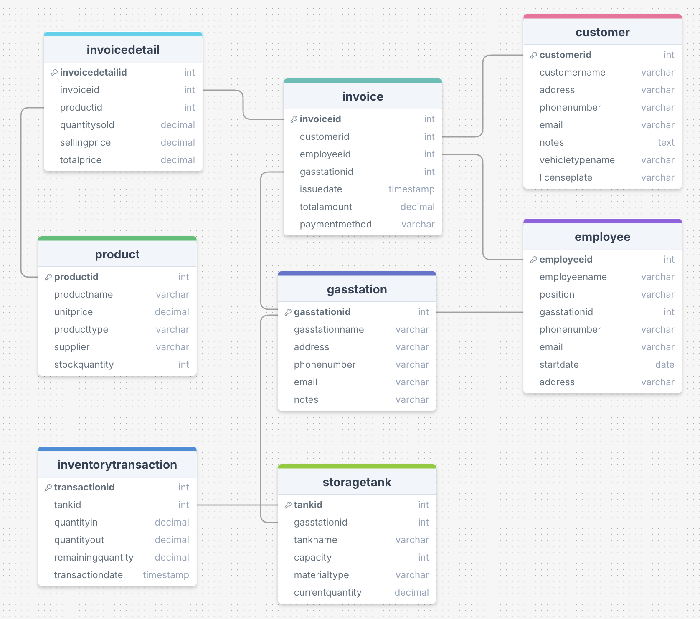
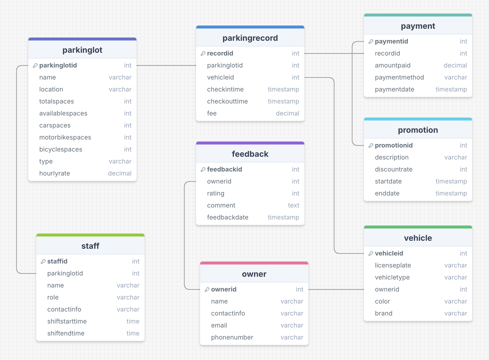
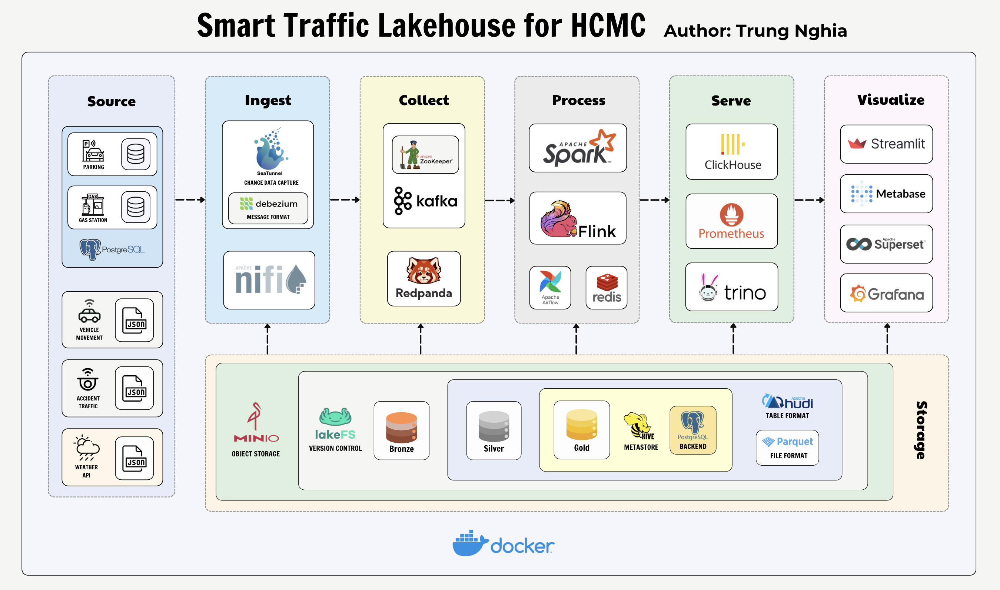
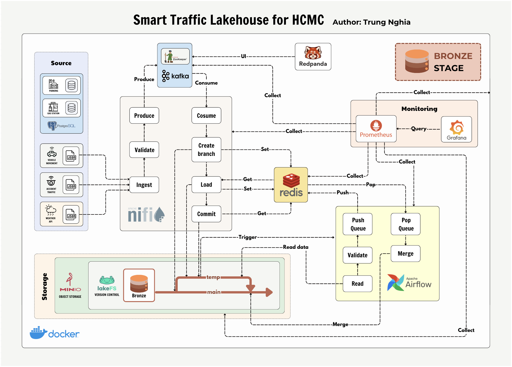
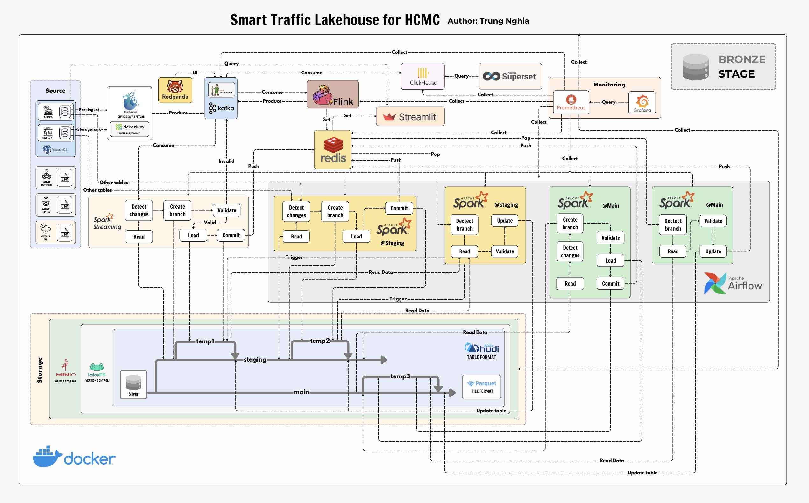
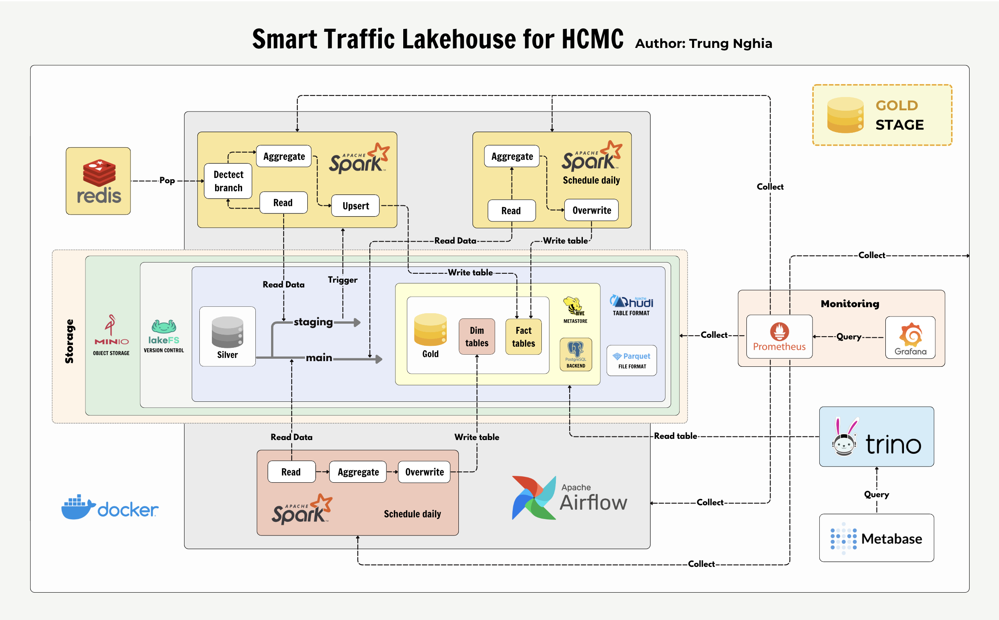
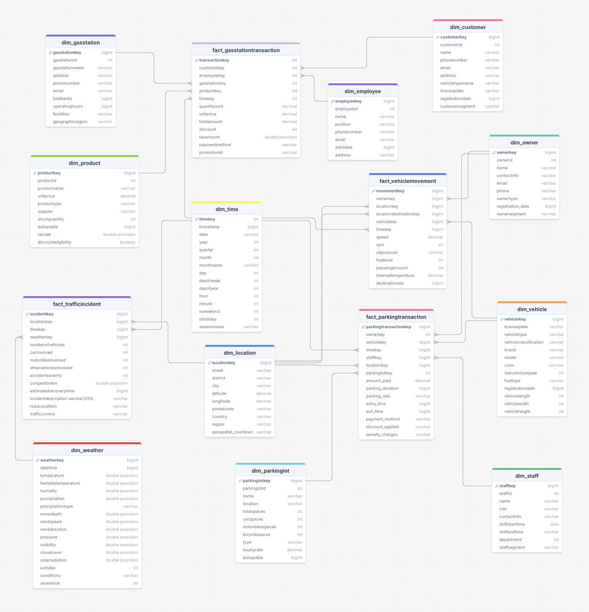

# SmartTraffic_Lakehouse_for_HCMC

**WARNING:** This project only runs on ARM64 chips.

# Project Objective

# Datasets Selection

## 1. Parking transactions data in HCM City on PostgreSQL

- Source: [ParkingDB_HCMCity_PostgreSQL](https://www.kaggle.com/datasets/ren294/parkingdb-hcmcity-postgres)

This database manages operations for a parking lot system in Ho Chi Minh City, Vietnam, tracking everything from parking records to customer feedback. The database contains operational data for managing parking facilities, including vehicle tracking, payment processing, customer management, and staff scheduling.

<center>
      
  </center>

## 2. Gas Station data in HCM City on PostgreSQL

- Source: [GasStationDB_HCMCity_PostgreSQL](https://www.kaggle.com/datasets/ren294/gasstationdb-hcmcity-postgres)

This database manages operations for a chain of gas stations in Ho Chi Minh city, Viet Nam, tracking everything from fuel sales to inventory management. The database contains operational data for managing gas stations, including sales transactions, inventory tracking, customer management, and employee records.

<center>
      
  </center>

## 3. IOT data road transport in HCM City

- Source: [IOT_RoadTransport_HCMCity](https://www.kaggle.com/datasets/ren294/iot-car-hcmcity)

The dataset provided describes information about a vehicle (in this case, a motorbike) moving along a specific road in Ho Chi Minh City. It includes various details about the vehicle, its owner, weather conditions, traffic status, and alerts related to the vehicle during its journey. This data can be used in traffic monitoring systems, vehicle operation analysis, or smart transportation services.

Here is the schema of the provided JSON, described in a hierarchical structure:

```json
{
  "vehicle_id": "string",
  "owner": {
    "name": "string",
    "license_number": "string",
    "contact_info": {
      "phone": "string",
      "email": "string"
    }
  },
  "speed_kmph": "float",
  "road": {
    "street": "string",
    "district": "string",
    "city": "string"
  },
  "timestamp": "string",
  "vehicle_size": {
    "length_meters": "float",
    "width_meters": "float",
    "height_meters": "float"
  },
  "vehicle_type": "string",
  "vehicle_classification": "string",
  "coordinates": {
    "latitude": "float",
    "longitude": "float"
  },
  "engine_status": {
    "is_running": "boolean",
    "rpm": "int",
    "oil_pressure": "string"
  },
  "fuel_level_percentage": "int",
  "passenger_count": "int",
  "internal_temperature_celsius": "float",
  "weather_condition": {
    "temperature_celsius": "float",
    "humidity_percentage": "float",
    "condition": "string"
  },
  "estimated_time_of_arrival": {
    "destination": {
      "street": "string",
      "district": "string",
      "city": "string"
    },
    "eta": "string"
  },
  "traffic_status": {
    "congestion_level": "string",
    "estimated_delay_minutes": "int"
  },
  "alerts": [
    {
      "type": "string",
      "description": "string",
      "severity": "string",
      "timestamp": "string"
    }
  ]
}
```

## 4. Traffic accidents data in HCM City

- Source: [Traffic_Accidents_HCMCity](https://www.kaggle.com/datasets/ren294/traffic-accidents-hcmcity)

The dataset provided contains information about a road accident that took place on various roads inHo Chi Minh City. It includes details about the accident, such as the vehicles involved, severity, accident time, recovery time, and traffic congestion caused by the accident. This data can be useful for traffic management systems, accident reporting, and analyzing traffic patterns.

Here is the schema of the provided JSON, described in a hierarchical structure:

```json
{
  "road_name": "string",
  "district": "string",
  "city": "string",
  "vehicles_involved": [
    {
      "vehicle_type": "string",
      "vehicle_id": "string"
    }
  ],
  "accident_severity": "int",
  "accident_time": "string",
  "number_of_vehicles": "int",
  "estimated_recovery_time": "string",
  "congestion_km": "float",
  "description": "string"
}
```

## 5. Weather data from API in HCM City

- Source: [VisualCrossing](https://www.visualcrossing.com/weather-api)

The dataset provided contains detailed weather information for Ho Chi Minh City, including temperature, humidity, wind conditions, precipitation, and other meteorological measurements. This data is collected hourly and aggregated daily, useful for weather forecasting, climate analysis, and urban planning applications.

Here is the schema of the provided JSON, described in a hierarchical structure:

```json
{
  "latitude": "number",
  "longitude": "number",
  "resolvedAddress": "string",
  "address": "string",
  "timezone": "string",
  "tzoffset": "number",
  "days": [
    {
      "datetime": "string",
      "datetimeEpoch": "number",
      "tempmax": "number",
      "tempmin": "number",
      "temp": "number",
      "feelslike": "number",
      "humidity": "number",
      "precip": "number",
      "windspeed": "number",
      "winddir": "number",
      "pressure": "number",
      "cloudcover": "number",
      "visibility": "number",
      "uvindex": "number",
      "sunrise": "string",
      "sunset": "string",
      "conditions": "string",
      "hours": [
        {
          "datetime": "string",
          "temp": "number",
          "feelslike": "number",
          "humidity": "number",
          "precip": "number",
          "windspeed": "number",
          "winddir": "number",
          "conditions": "string"
        }
      ]
    }
  ]
}
```

# System Architecture

The **Data Lakehouse** architecture implemented in this project is meticulously designed to accommodate both batch and real-time streaming data, seamlessly integrating multiple data sources into a cohesive analytics platform. This architecture follows the Me dallion Architecture pattern, which organizes data into **Bronze**, **Silver**, and **Gold** layers, each serving specific roles in the data lifecycle.

## System Overview

The system is divided into several components, each responsible for specific tasks within the data process:

<center>
      
  </center>

The architecture consists of several key components:

### 1. Data Ingestion Layer

- **Seatunnel**: Handles CDC (Change Data Capture) using Debezium format
- **Apache NiFi**: Manages data routing and transformation

### 2. Data Collection Layer

- **Apache Kafka & Zookeeper**: Handles real-time data streaming
- **Redpanda UI**: Provides Kafka management interface

### 3. Processing Layer

- **Apache Spark**: Batch processing
- **Apache Flink**: Stream processing
- **Apache Airflow**: Workflow orchestration
- **Redis**: Data caching

### 4. Storage Layer

- **MinIO**: Object storage
- **lakeFS**: Data versioning
- **Apache Hudi**: Storage format for Silver layer
- **Apache Hive**: Data warehouse for Gold layer
- **PostgreSQL**: Metastore backend

### 5. Serving Layer

- **ClickHouse**: OLAP database
- **Prometheus**: Metrics storage
- **Trino**: Distributed SQL query engine

### 6. Visualization Layer

- **Streamlit**: Interactive dashboards
- **Metabase**: Business analytics
- **Apache Superset**: Data exploration
- **Grafana**: Metrics visualization

## Data Processing Stages

### Bronze Stage: Raw Data Acquisition & Validation

<center>
      
  </center>

#### a. Data Ingestion Layer

The Bronze stage serves as the initial landing zone for raw data, implementing a robust ingestion and validation pipeline:

##### Real-time Data Sources

- **Weather API Data**: Live weather metrics and forecasts
- **Traffic Data**: Real-time traffic conditions and events
- **Vehicle IOT Data**: Streaming vehicle telemetry and sensor data

##### Ingestion Process

- **Initial Collection**
  - `Apache NiFi` orchestrates data collection from all sources
  - Implements initial data validation and formatting
  - Ensures data completeness and basic quality checks
- **Stream Processing**
  - Data streams are directed to `Kafka` (managed via `Redpanda UI`)
  - Implements message validation and schema verification
  - Maintains data lineage and source tracking

#### b. Storage Management

The Bronze stage implements a sophisticated version-controlled storage strategy:

##### Version Control Process

- **Branch Management**
  - Creates temporary branches from main Bronze repository
  - Implements atomic commits for data consistency
  - Maintains data versioning through `lakeFS`
- **Commit Workflow**
  - Automated validation triggers on commit
  - `Airflow` DAGs orchestrate `Spark` jobs for data verification
  - Successful validation merges changes to main branch

#### c. Monitoring & Performance

- **Caching Layer**: `Redis` implementation for frequently accessed data
- **Monitoring Stack**:
  - `Prometheus` metrics collection
  - `Grafana` dashboards for real-time monitoring
  - Performance metrics and SLA tracking

### 2. Silver Stage: Data Transformation & Enrichment

<center>
        
  </center>

#### a. Data Sources Integration

The Silver stage combines multiple data streams and implements advanced processing:

##### Change Data Capture (CDC)

- **PostgreSQL Integration**:
  - Real-time monitoring of ParkingLot and StorageTank tables
  - `Seatunnel` implementation with `Debezium` format
  - Maintains data consistency and transaction order

##### Stream Processing Architecture

- **Real-time Processing Pipeline**

  - `Flink` processes incoming `Kafka` streams
  - Implements business logic and data enrichment
  - Maintains stateful processing for complex operations
- **Data Quality Management**

  - `Spark Streaming` validates processed data
  - Implements data quality rules and business constraints
  - Maintains data consistency across branches

#### b. Multi-Branch Processing Strategy

The Silver stage implements a sophisticated branching strategy:

##### Staging Branch Processing

- **Change Detection**
  - Continuous monitoring of data changes
  - `Spark` jobs compare incoming data with staging
  - Implements delta detection algorithms

- **Branch Management**
  - Creates temporary branches for changes
  - Implements validation before commit
  - Maintains data lineage and audit trails

##### Main Branch Updates

- **Hourly Synchronization:**
  - `Airflow` DAGs orchestrate main branch updates
  - Implements merge conflict resolution
  - Maintains data consistency and quality

#### c. Data Serving Layer

##### Analytics Processing

- `ClickHouse` collects processed Kafka data
- `Superset` provides visualization capabilities
- Implements real-time analytics queries

##### Application Integration

- `Streamlit` applications consume processed data
- Combines `Redis` cache with `PostgreSQL` data
- Provides real-time user interfaces

### 3. Gold Stage Processing

<center>
      
  </center>

#### a. Dimensional Modeling

The Gold stage implements a robust dimensional model:

##### Dimension Tables Management

- **Daily Processing**

  - Scheduled Airflow DAGs process Silver layer data
  - Implements slowly changing dimension logic
  - Maintains historical accuracy and tracking
- **Aggregation Pipeline**

  - Spark jobs perform complex aggregations
  - Implements business rules and calculations
  - Maintains data consistency and accuracy

#### b. Fact Table Processing

- **Real-time Updates**

  - Triggered by Silver layer changes
  - Implements upsert operations for fact tables
  - Maintains transactional consistency
- **Batch Processing**

  - Daily scheduled updates from Silver layer
  - Implements full refresh of fact tables
  - Maintains historical accuracy

#### c. Process Orchestration

- **Workflow Management:**
  - Airflow orchestrates all Spark jobs
  - Implements dependency management
  - Maintains process monitoring and logging

#### d. Performance Optimization

- **Caching Strategy:**
  - Redis caches frequently accessed data
  - Implements cache invalidation rules
  - Maintains performance SLAs

#### e. Monitoring & Governance

- **Quality Assurance:**
  - Prometheus metrics collection
  - Grafana dashboards for monitoring
  - Implements SLA monitoring and alerting

# Data Warehouse Architecture in the Gold Layer

The Gold Layer in a data lakehouse architecture represents the final, refined stage where clean, processed, and analytics-ready data is stored. This layer is specifically designed for consumption by business intelligence tools, data scientists, and analysts. In the context of an Traffic Data Warehouse, the Gold Layer is where critical business metrics, aggregated datasets, and key insights are stored in an optimized format.

The schema DataWarehouse:

<center>
      
  </center>

# Deployment

## System Requirements

To deploy and run this *Data Lakehouse* project, the following system requirements are necessary:

### Hardware

- **Processor**: `ARM64` chip with at least 12 CPU cores.

- **Memory**: 32 GB of RAM.

- **Storage**: 50 GB of free storage space.

### Software

- **Operating System**: A `Linux-based` OS supporting `ARM64` architecture.

- **Docker**: Pre-installed to run all components in isolated containers.

- **Docker Compose**: Pre-installed for orchestrating multi-container Docker applications.

- **Git**: For version control and project deployment

