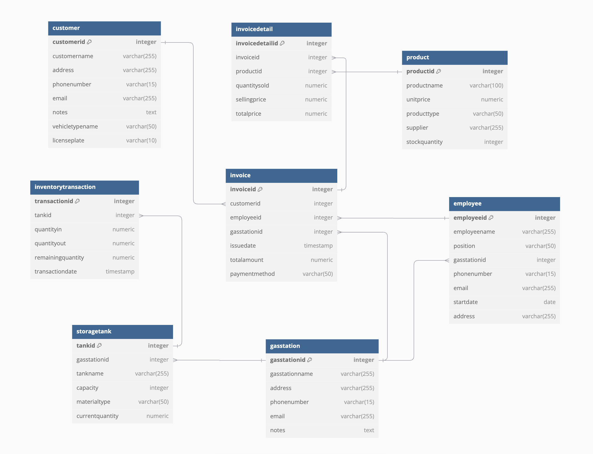
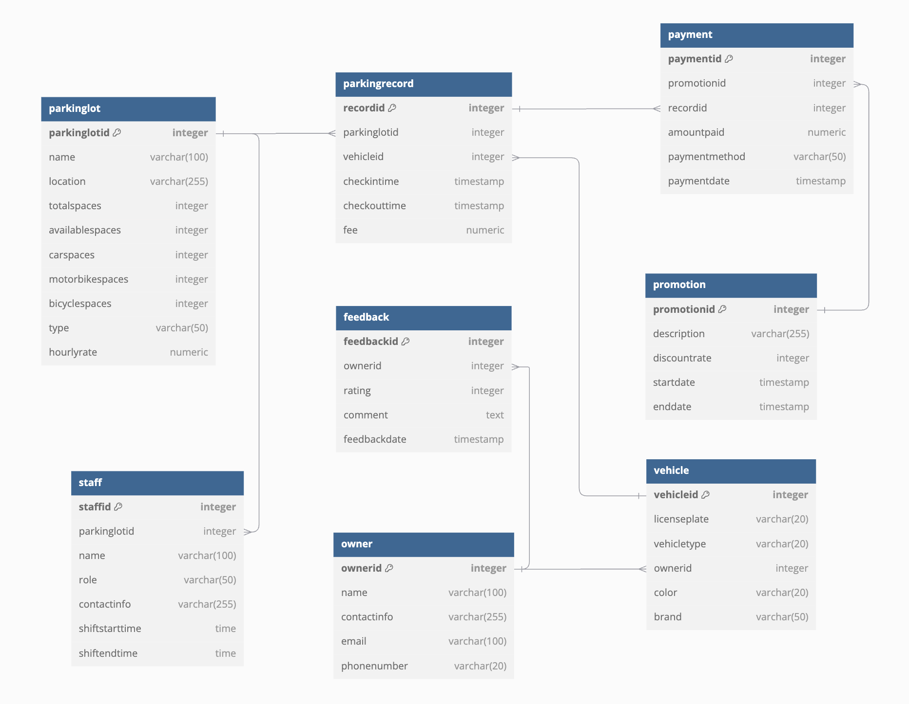

# SmartTraffic_Lakehouse_for_HCMC

**WARNING:** This project only runs on ARM64 chips.

# Datasets Selection

## 1. Parking transactions data in HCM City on PostgreSQL

- Source: [ParkingDB_HCMCity_PostgreSQL](https://www.kaggle.com/datasets/ren294/parkingdb-hcmcity-postgres)

This database manages operations for a parking lot system in Ho Chi Minh City, Vietnam, tracking everything from parking records to customer feedback. The database contains operational data for managing parking facilities, including vehicle tracking, payment processing, customer management, and staff scheduling.

  <center>
      
  </center>

## 2. Gas Station data in HCM City on PostgreSQL

- Source: [GasStationDB_HCMCity_PostgreSQL](https://www.kaggle.com/datasets/ren294/gasstationdb-hcmcity-postgres)

This database manages operations for a chain of gas stations in Ho Chi Minh city, Viet Nam, tracking everything from fuel sales to inventory management. The database contains operational data for managing gas stations, including sales transactions, inventory tracking, customer management, and employee records.

  <center>
      
  </center>

## 3. IOT data road transport in HCM City

- Source: [IOT_RoadTransport_HCMCity](https://www.kaggle.com/datasets/ren294/iot-car-hcmcity)

The dataset provided describes information about a vehicle (in this case, a motorbike) moving along a specific road in Ho Chi Minh City. It includes various details about the vehicle, its owner, weather conditions, traffic status, and alerts related to the vehicle during its journey. This data can be used in traffic monitoring systems, vehicle operation analysis, or smart transportation services.

Here is the schema of the provided JSON, described in a hierarchical structure:

```json
{
  "vehicle_id": "string",
  "owner": {
    "name": "string",
    "license_number": "string",
    "contact_info": {
      "phone": "string",
      "email": "string"
    }
  },
  "speed_kmph": "float",
  "road": {
    "street": "string",
    "district": "string",
    "city": "string"
  },
  "timestamp": "string",
  "vehicle_size": {
    "length_meters": "float",
    "width_meters": "float",
    "height_meters": "float"
  },
  "vehicle_type": "string",
  "vehicle_classification": "string",
  "coordinates": {
    "latitude": "float",
    "longitude": "float"
  },
  "engine_status": {
    "is_running": "boolean",
    "rpm": "int",
    "oil_pressure": "string"
  },
  "fuel_level_percentage": "int",
  "passenger_count": "int",
  "internal_temperature_celsius": "float",
  "weather_condition": {
    "temperature_celsius": "float",
    "humidity_percentage": "float",
    "condition": "string"
  },
  "estimated_time_of_arrival": {
    "destination": {
      "street": "string",
      "district": "string",
      "city": "string"
    },
    "eta": "string"
  },
  "traffic_status": {
    "congestion_level": "string",
    "estimated_delay_minutes": "int"
  },
  "alerts": [
    {
      "type": "string",
      "description": "string",
      "severity": "string",
      "timestamp": "string"
    }
  ]
}
```

## 4. Traffic accidents data in HCM City

- Source: [Traffic_Accidents_HCMCity](https://www.kaggle.com/datasets/ren294/traffic-accidents-hcmcity)

The dataset provided contains information about a road accident that took place on various roads inHo Chi Minh City. It includes details about the accident, such as the vehicles involved, severity, accident time, recovery time, and traffic congestion caused by the accident. This data can be useful for traffic management systems, accident reporting, and analyzing traffic patterns.

Here is the schema of the provided JSON, described in a hierarchical structure:

```json
{
  "road_name": "string",
  "district": "string",
  "city": "string",
  "vehicles_involved": [
    {
      "vehicle_type": "string",
      "vehicle_id": "string"
    }
  ],
  "accident_severity": "int",
  "accident_time": "string",
  "number_of_vehicles": "int",
  "estimated_recovery_time": "string",
  "congestion_km": "float",
  "description": "string"
}
```

## 5. Weather data from API in HCM City

- Source: [VisualCrossing](https://www.visualcrossing.com/weather-api)

The dataset provided contains detailed weather information for Ho Chi Minh City, including temperature, humidity, wind conditions, precipitation, and other meteorological measurements. This data is collected hourly and aggregated daily, useful for weather forecasting, climate analysis, and urban planning applications.

Here is the schema of the provided JSON, described in a hierarchical structure:

```json
{
  "latitude": "number",
  "longitude": "number",
  "resolvedAddress": "string",
  "address": "string",
  "timezone": "string",
  "tzoffset": "number",
  "days": [
    {
      "datetime": "string",
      "datetimeEpoch": "number",
      "tempmax": "number",
      "tempmin": "number",
      "temp": "number",
      "feelslike": "number",
      "humidity": "number",
      "precip": "number",
      "windspeed": "number",
      "winddir": "number",
      "pressure": "number",
      "cloudcover": "number",
      "visibility": "number",
      "uvindex": "number",
      "sunrise": "string",
      "sunset": "string",
      "conditions": "string",
      "hours": [
        {
          "datetime": "string",
          "temp": "number",
          "feelslike": "number",
          "humidity": "number",
          "precip": "number",
          "windspeed": "number",
          "winddir": "number",
          "conditions": "string"
        }
      ]
    }
  ]
}
```

# System Architecture

The **Data Lakehouse** architecture implemented in this project is meticulously designed to accommodate both batch and real-time streaming data, seamlessly integrating multiple data sources into a cohesive analytics platform. This architecture follows the Medallion Architecture pattern, which organizes data into **Bronze**, **Silver**, and **Gold** layers, each serving specific roles in the data lifecycle.

## System Overview

The system is divided into several components, each responsible for specific tasks within the data process:

  <center>
      
  </center>
